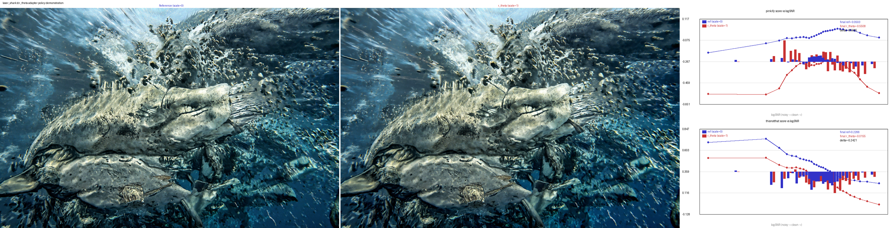
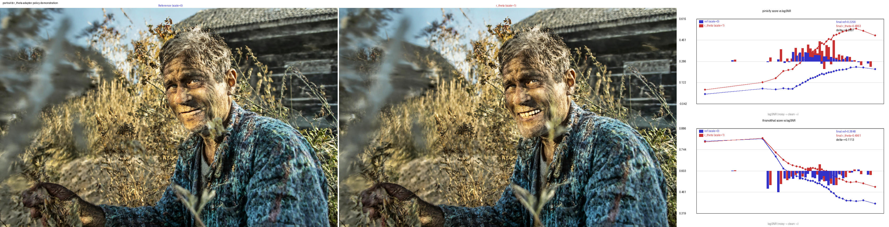
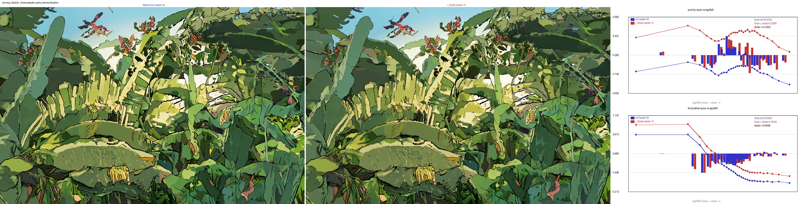

## futudiffu

future diffusers.

### what is this repository?

the future of diffusers!

#### no, seriously?

modern deep learning models are trained by unsupervised learning on lots of different data.

the more they see, the more they learn.

but modern deep learning models are not pretrained and then released.

there are other things you have to do besides 'pretraining' to make a useable machine learning model people can deploy and run.

this repository covers several important gaps in 'midtraining' and 'posttraining' allowing the task adaptation of diffusion models.

### major features:

- various kernels you shouldn't need to look at
- verifiable reward functions as an *example of use* to promote ordinary software development over rewards
- pairwise ranking reward model training code to teach unsupervised models to 'look' for visual features
- two demonstration BTRM heads demonstrating PINKIFY/THISNOTTHAT rankings 
- total liberation from comfyui; we're all free now, you never need to drag the nodes/noodles around ever again.
- todo: stepcount and activation quantization distillation reward models as alternative to reward weighted odds maximization distillation
- todo: DRGPO for denoising diffusion (porting in progress)
- todo: total replacement of buggy shim code first pass codebase
- todo: SSDIT text encoder quantization aware distillation training
- todo: vlm-as-judge RLVR support (super advanced feature: requires cross integration w/ primeintellect environments to *train* judge VLMs)

## r_theta validation

This is a compact demonstration that reward models implemented as low rank adapters over pretrained models... use the existing residual stream and feature circuits from unsupervised objectives.

- A reward adapter (r_theta) is trained via BTRM to simply predict whether an image is more or less pink, and more like reference_image_a while also less like reference_image_b. 
- The composites below show reference (no adapter) model sampling trajectories on the left and r_theta intervened-models on the right.
- Plots demonstrate BTRM scores for each step for both the pinkify and thisnotthat reward heads in both the reference model's sampling trajectories and the reward-intervened model's sampling trajectories.
- Reward models trained to detect pinkness don't make sampled images more pink; reward adapters are not policy adapters.

### why?

brain hurt after trying to cram for mats / anthropic fellows code screens in ancient dead languages no longer used in ml, needed cooldown exercise